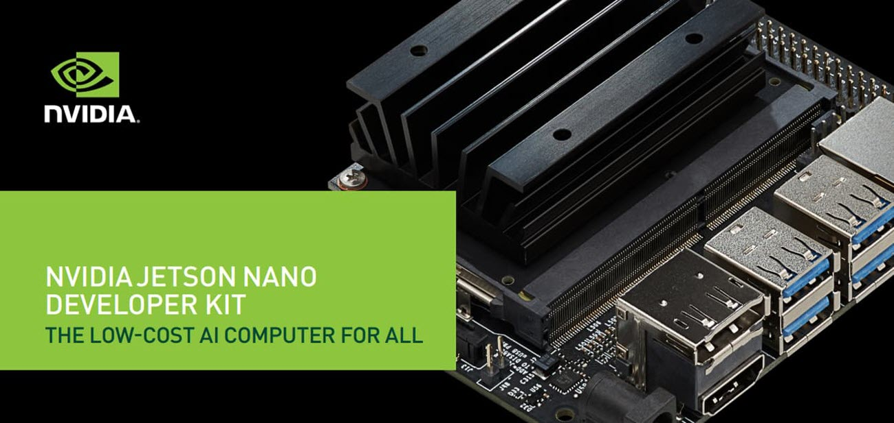

# Smart-Devices (Edge Computing with NVIDIA Jetson Nano)
Solution that enables IoT supported devices to "see" human activity and automatically turn on/off.  Computer Vision &amp; Object Detection is used to detect human presence and send a signal to an IoT device so that it can operate automatically.
  
This program performs person detection at the edge, eliminating the need to send the video feed to the cloud for inference. 
Person Detection is performed at the edge using <b>Nvidia Jetson Nano SBC (Single-Board Computer) at a frame rates of 20-25 FPS</b>. 
 
Note: This program will only work on the Nvidia Jetson Nano SBC. See this <a href="https://github.com/gurpreet-5555/Smart-Devices">project</a> for running it on more devices.

In this project, we are using the 'ssd-mobilenet-v2' object detection architecture, specially optimized for Nvidia Graphic Processing Units (TensorRT).
TensorRT is a high-performance neural network inference optimizer and runtime engine that optimizes a CNN(Convolutional Neural Network) by combining layers for improved performance, low memory consumption and faster inference.
  
More details on object detection models: <a href="https://docs.nvidia.com/deeplearning/tensorrt/developer-guide/index.html">NVIDIA TensorRT Documentation</a>

 

<h2>Features:</h2>
<ul>
  <li>Control an IoT enabled device automatically by detecting human activity</li>
  <li>Perform object detection on Edge Device @ 20-25 FPS</li>
  <li>Real-time person detection</li>
  <li>Specify confidence threshold for detection to compensate for poor lighting/image quality</li>
  <li>Countdown Timer for starting & stopping a device</li>
  <li>Support for multiple streaming protocols from IP cameras such as rtsp, http. Can also be used with static video file depending on installed codecs(.mp4, .avi etc..)</li>
</ul>  

<h2>Detections</h2>

<h2>Requirements:</h2>
<ul>
  <li>Python 3.6</li>
  <li>OpenCV 3.3.1</li>
  <li>TensorRT 5.1.6</li>
  <li>Cuda 10.0</li>
  <li>NumPy 1.19.0</li>  
</ul>

<h2>How to use?</h2>
<ul>
  <li>Clone Repository</li>
  <pre>git clone https://github.com/gurpreet-5555/Smart-Devices-Edge-Computing.git</pre>  </ul>
<ul>  <li>Navigate to main directory</li>
  <pre>cd Smart-Devices-Edge-Computing</pre> </ul>
<ul><li>Specify your code in <b>device_controller.py</b> to start and stop IoT powered device.</li>
<pre>Sample code is included to turn on/off Philips Hue Lamps</pre></ul>
<ul><li>Execute Program</li>
<pre>python start_detection.py --confidence 0.4 --stream http://192.168.1.43:8080/video --startthreshold 10 --stopthreshold 60</pre>
<pre>Arguments -
confidence : Confidence threshold (0.0 to 1.0) for person detection. Use a lower value to compensate for poor lighting or image quality. (Optional)
stream : Source of video feed (http, rtsp etc) or video file. Specify this parameter as 0 to use in-built webcam.(Required)
startthreshold: Time to wait in seconds before device starts once human activity is detected. Default value is 5 seconds. (Optional)
stopthreshold: Time to wait in seconds before device stops once no human activity is detected in video stream. Default value is 30 seconds. (Optional)
</pre></ul>
